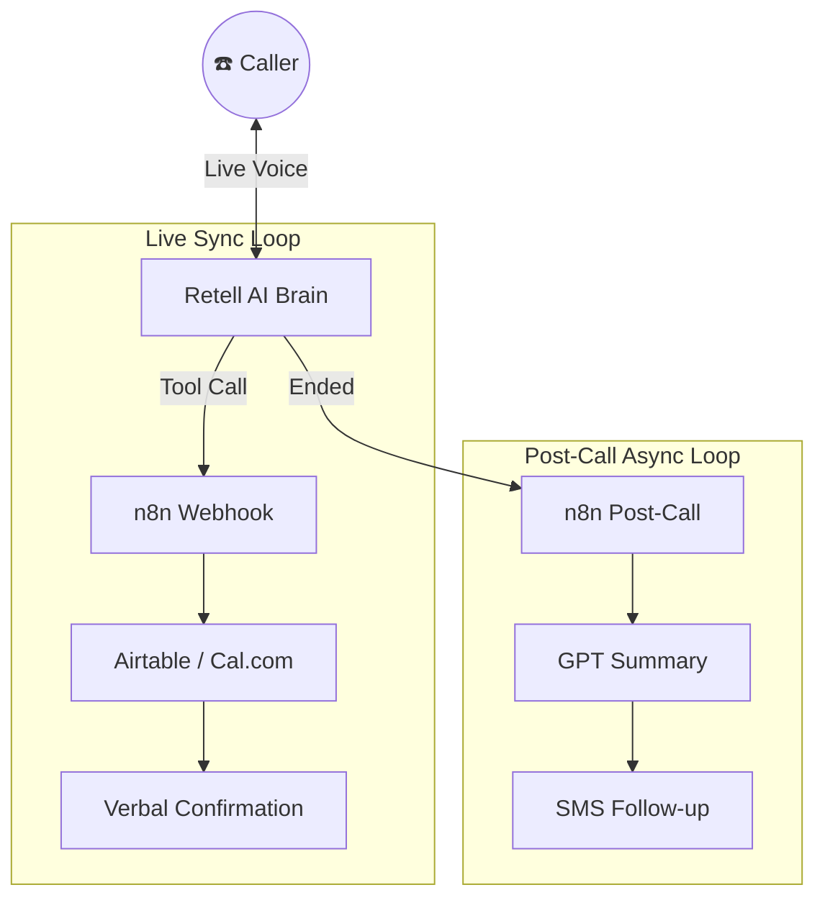

# How to Build a Production-Ready AI Receptionist Template (Retell AI + n8n)

![Header Image Prompt: A professional 3D technical isometric diagram showing a glowing digital brain connected via neon light paths to a central automation hub. Apple-minimalist style.]

## Introduction
Right now, every client wants an AI receptionist, but building bespoke voice agents from scratch for every single business is a one-way ticket to ruined profit margins and developer burnout. The secret most automation agencies figure out the hard way is that 90% of front desk operations boil down to three tasks: booking appointments, routing support tickets, and capturing lead info.

Instead of reinventing the wheel, you need a modular, production-ready template where the heavy lifting of API routing, error handling, and conversational guardrails is already done. By wiring up **Retell AI** as our conversational brain and **n8n** as our automated nervous system, we are going to build a master plug-and-play asset that lets you deploy a fully functional AI receptionist for any industry just by swapping a few variables.

### The Blueprint
When a caller speaks, Retell AI processes their intent and triggers a "Custom Tool," sending a JSON webhook payload to n8n. n8n then acts as the traffic cop:
- **Scenario A (Booking):** Checks calendar and confirms the time.
- **Scenario B (Support):** Pushes the issue into a ticketing system.
- **Scenario C (Lead Capture):** Parses contact info into a CRM.

---

## Step 1: Configuring the Retell AI Voice Engine
Head to your Retell AI dashboard and create a new Agent.

### Voice & Persona
- **Voice Selection:** Choose a warm, professional voice like "Katherine."
- **Voice Model:** Set to **Auto (Elevenlabs Turbo V2)** for the lowest latency.
- **Execution Mode:** Select **Flex Mode**. This allows the AI to pivot smoothly (e.g., switching from booking to answering a pricing question without crashing).

### Global Prompt
Treat this like a list of operating procedures, not a creative writing exercise:
```markdown
# ROLE
You are Brenda, the efficient front-desk receptionist for [COMPANY_NAME]. 

# GOAL
Assist the caller with:
1. Booking an appointment.
2. Logging a support issue.
3. Capturing lead info for a callback.

# INSTRUCTIONS
- Use the appropriate tool based on user intent.
- ALWAYS confirm success AFTER a tool successfully runs.
```

---

## Step 2: Spinning Up Production n8n
We use **Docker Compose** with **PostgreSQL** to ensure our environment is perfectly portable.

### The Secrets (.env)
```env
# N8N Credentials
N8N_ENCRYPTION_KEY=your-secret-key
WEBHOOK_VERIFICATION_TOKEN=your-secure-token

# Service Keys
AIRTABLE_BASE_ID=app7Wh...
CALCOM_API_KEY=cal_live...
RETELL_API_KEY=key_...
```

---

## Step 3: Building the n8n "Traffic Cop"
In n8n, create a new workflow and add a **Webhook Node**.
- **Path:** `retell`
- **Authentication:** **Header Auth** (This is crucial for production security).
- **Respond:** Set to "Using 'Respond to Webhook' Node."

Add a **Switch Node** connected to the Webhook. Configure it to route based on `{{ $json.body.name }}`:
1. `book_appointment` -> Output 0
2. `create_support_ticket` -> Output 1
3. `capture_lead` -> Output 2

---

## Step 4: The "Production-Ready" Pillars
A basic tutorial stops here. A **Production-Ready** guide adds the defensive layers that agencies charge a premium for.

### Pillar 1: The "Never-Drop" Error Pattern
In the real world, APIs fail. We implement the **`onError: continueErrorOutput`** pattern on every tool node.
- **Success:** Routes to standard confirmation.
- **Error:** Routes to a specialized "Error Response" node where the AI says: *"I'm having a technical issue saving those details, but I'll notify my team manually. Can you confirm your phone number one more time?"*
This ensures the caller never feels like they are talking to a broken machine.

### Pillar 2: Intelligent Lead Scoring
Don't just capture data; qualify it. We inserted a **Code Node** between the Webhook and Airtable:

```javascript
const args = $json.args || {};
const service = (args.service_requested || "").toLowerCase();
const email = (args.caller_email || "").toLowerCase();

let score = 0;

// Urgency Multiplier
if (service.includes("leak") || service.includes("emergency")) {
  score += 50;
}

// Commercial Domain Detection
const personal = ["gmail.com", "outlook.com", "yahoo.com"];
const domain = email.split("@")[1];
if (domain && !personal.includes(domain)) {
  score += 20; 
}

return { args: { ...args, lead_score: score, lead_status: score >= 50 ? "VIP" : "new_lead" } };
```

### Pillar 3: The Human Handoff (Escape Hatch)
We created a 4th tool: `transfer_call`. When a user asks for a "manager" or an emergency is detected, n8n returns:
`{"forward_to_number": "+1234567890"}`
Retell reads this and performs a live PSTN transfer. It’s the ultimate safety net.

---

## Step 5: Post-Call Automation (Closing the Loop)
The conversation doesn't end when the caller hangs up. We built a secondary workflow triggered by the `call_ended` webhook.

1.  **AI Summarization:** Transcript is sent to `gpt-4o-mini` for a 1-sentence summary and sentiment analysis.
2.  **CRM Logging:** Summary and recording URL are logged in Airtable.
3.  **SMS Follow-up:** A **Twilio node** texts the caller:
    > *"Hi! This is Brenda from Apex Roofing. Thanks for calling! I've noted your request for a roof inspection. Our team is on it!"*

---

## Step 6: Deployment to Production (Hetzner VPS)
To turn this from a local prototype into a live business asset, we need a reliable home for n8n.

1.  **Server Setup:** Use a **Hetzner CX21** (Ubuntu 22.04). It’s low-cost and high-performance.
2.  **Environment:** Install Docker and Clone your repository.
3.  **Launch:** Run `docker compose up -d` to start the engine.
4.  **Reverse Proxy:** Use **Caddy** or **Nginx Proxy Manager** to map your server IP to a clean domain with SSL (e.g., `https://n8n.youragency.com`).
5.  **Final Step:** Update your tool URLs in the Retell dashboard to point to your new live domain.

---

## Technical Architecture
We use a **Dual-Loop Architecture** to minimize latency during the call:



## Conclusion: Your Scalable SaaS Asset
By replacing hardcoded IDs with **Environment Variables**, you’ve created a **Portable SaaS Asset**. When you sign a new client, you update one `.env` file, import your JSONs, and their front desk is automated in 20 minutes. 

You aren't just selling "AI"; you are selling a secure, resilient, and intelligent system that scales.

---
**Author's Note:** Ready to deploy? Check out the full repo and environment configuration in the [README](./README.md).
